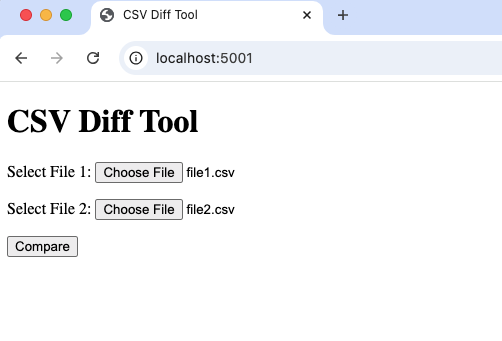

# CSV Diff Tool

A simple web-based tool to compare two CSV files.  
It runs locally with Python and shows which rows exist only in File 1 or only in File 2.  
The output is easy to read and downloadable as a CSV.

---

## Features
- Upload two CSV files from your browser
- Automatically sorts by a key column (default: `id`) before comparing
- Clear result sections: “Only in File1” and “Only in File2”
- Row counts included in the result

---

## How to Run

1. Install Python 3 if you don’t have it yet.
2. Install dependencies in your project folder:
   ```bash
   pip install flask pandas
   ```
3. Start the app:
   ```bash
   python app.py
   ```
4. Open your browser and go to:
   ```
   http://localhost:5001
   ```
5. Upload two CSV files and click **Compare**.

---

## Example Output

```
Total rows only in File1: 2
Total rows only in File2: 2

Only in File1:
id,name,value,_merge
1,Alice,100,left_only
3,Charlie,300,left_only

Only in File2:
id,name,value,_merge
3,Charlie,350,right_only
5,Eve,500,right_only
```

---

## Screenshot



---

## Project Structure

```
csv-diff-tool/
├── docs/
│   └── screenshot.png
├── app.py          # Flask web app
├── diff_core.py    # Core comparison logic
├── templates/
│   └── index.html  # Upload page
├── uploads/        # Uploaded files and results
└── README.md
```

---

**Author:** Jessica Zhong
